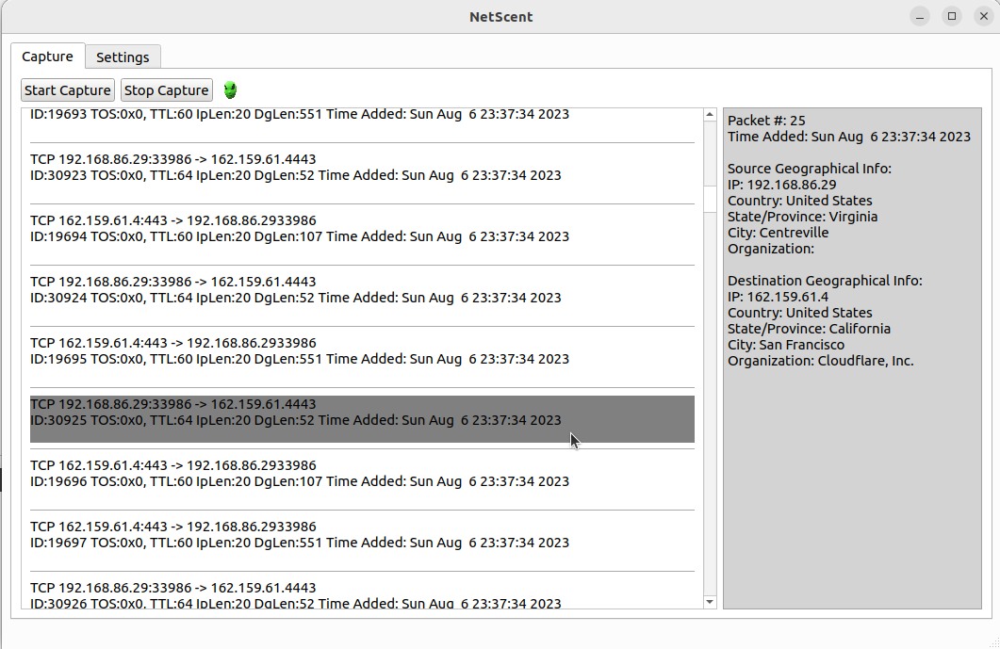

# NetScent

NetScent is a packet analyzer/sniffer designed to monitor local network traffic.  

NetScent allows users to view a continuous stream of network information, including source and destination IP addresses and approximate geographic locations, for devices involved in the exchange of intercepted packets.

This project is currently in an early, unfinished state, but I will continue adding features and fixes over time.


*main menu after capturing some packets*

## Purpose
This is a personal project, its main purpose is as a platform for me to use and improve my programming and C/C++ skills. However, in service of that purpose I will try to make this program as usable, useful, accessible, and performant as possible.

## How to Use
1. Ensure that you have an updated version of Linux installed*
2. Download dependencies:
    - In a terminal, run the command: ```sudo apt-get install '^libxcb.*-dev' libx11-xcb-dev libglu1-mesa-dev libxrender-dev libxi-dev libxkbcommon-dev libxkbcommon-x11-dev``` 
4. Download and unzip the latest release from the "Releases" tab on the right (**NetScent_Release_v0.0.1.zip**)
5. In a terminal
    - ```cd``` into the release folder
    - run the following commands (or similar):
        - ```chmod 777 NetScent.sh bin/NetScent```     
        - ```sudo ./NetScent.sh```
6. In the "Settings" tab, enter your API key for [IP geolocation](https://ipgeolocation.io/)
7. In the "Capture" tab click "Start Capture"

*Not guaranteed to work on all systems or configurations (Tested on a fresh install of **Ubuntu 22.04.2** running within VirtualBox)

## Rough Roadmap
- Improve IP geolocation 
- Add saving of packet data to local file
- Add more options for data analysis
- Add proper testing framework
- Build CI/CD pipeline (?)
- Implement graphical improvements
- Port to Windows

## Links
https://ipgeolocation.io/  

https://vichargrave.github.io/programming/develop-a-packet-sniffer-with-libpcap/
